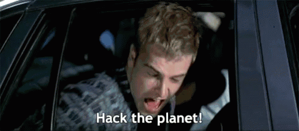

# 02 · Programm

Eine Uhr, zwei Tage. Die Zeiten sind der Rahmen — gearbeitet wird dazwischen.

|  | **Di 27. Oktober** | **Mi 28. Oktober** |
|---:|---|---|
| **09:00** | Welcome | Arbeitsphase |
| **09:10** | Themen, Quests & Beispiele | ↓ |
| **10:00** | Team- & Ideenfindung | ↓ |
| **13:00** | Mittagessen | Mittagessen |
| **14:00** | Arbeitsphase | Letzter Schliff |
| **14:30** | ↓ | **Projekt-Slam** |
| **15:00** | ↓ | Feedback-Runde |
| **15:15** | ↓ | Preisverleihung |
| **16:00** | ↓ | Ende |
| **17:00** | Check-in | |
| **18:00** | Abendessen | |
| **22:00** | Ende Tag 1 | |

**Check-in** am ersten Abend, drei Fragen pro Team: Was ist unser Ziel? Was haben wir geschafft? Wo brauchen wir Hilfe?

**Projekt-Slam** am zweiten Nachmittag — kurz, laut, alle Teams. Danach Feedback und Preise; im Anschluss ein lockeres Get-together auf eigene Rechnung für alle, die mögen.

## Setting

Gearbeitet wird im World-Café-Setting: Tischinseln im Hauptraum, zusätzliche Breakout-Räume für Teams, die Ruhe brauchen. Tutor:innen sind über beide Tage vor Ort und helfen bei APIs, Queries und allem, was klemmt.

---

[← Location](01-location.md) · [Übersicht](../README.md) · [Weiter: Quests →](03-quests.md)
