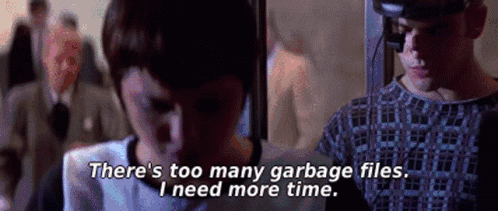

# 06 · Beispiele

Notebooks, Snippets, Prototypen, Sackgassen mit Lerneffekt. Was hier landet, spart den nächsten Teams eine Stunde.

## Aus dem Vorjahr

[Hack The Pool 2025](https://github.com/kulturpool/Hack-The-Pool-2025) — Beispiele und Projekte der letzten Ausgabe. Die APIs haben sich seither weiterentwickelt, das Meiste lässt sich trotzdem übertragen.

## 2026

*Noch leer. Erste Einträge kommen vor und während der Veranstaltung.*

| Beispiel | Quest | Was es zeigt | Wer |
|---|---|---|---|
| | | | |

## Projekte

Team-Ergebnisse werden nach dem Slam hier verlinkt — eigenes Repo oder Unterordner, beides recht.

| Projekt | Quest | Repo |
|---|---|---|
| | | |

## Beitragen

Kleines pro Pull Request: Zeile in die Tabelle, Code in einen Unterordner mit sprechendem Namen und einer kurzen `README.md` (Was, Voraussetzungen, wie starten). Für Notebooks bitte die Outputs drinlassen — dann ist auch ohne Ausführen sichtbar, was rauskommt.

---

[← Queries](05-queries.md) · [Übersicht](../README.md)
